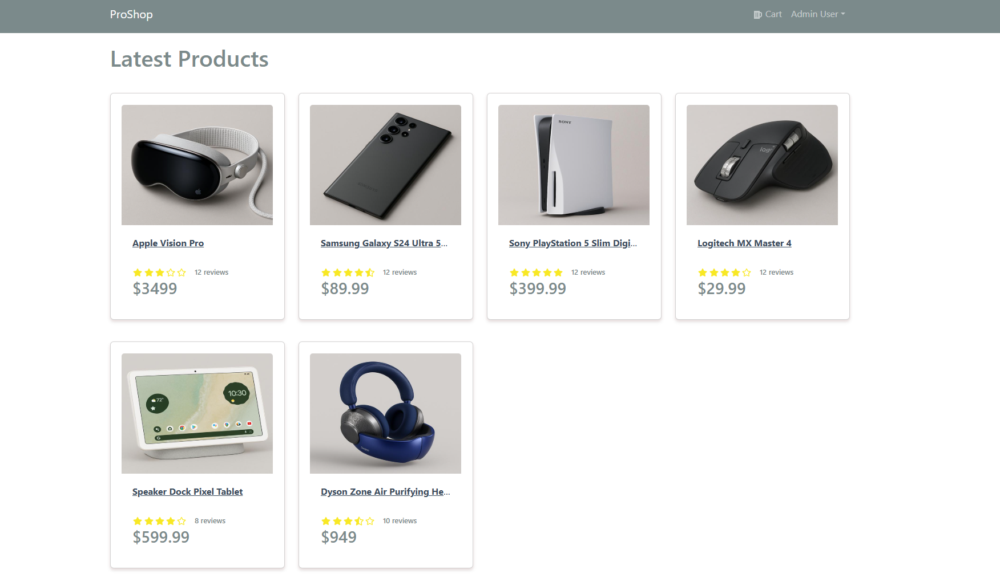
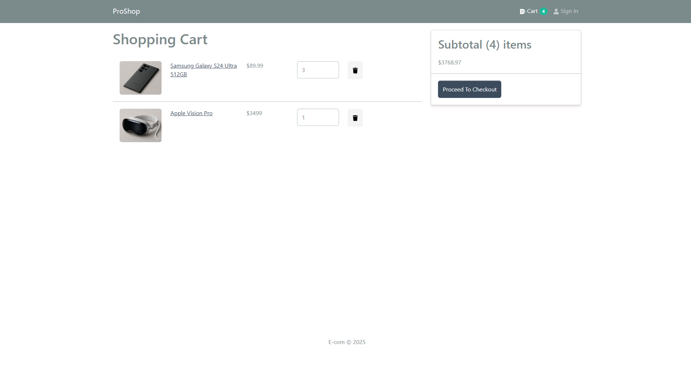
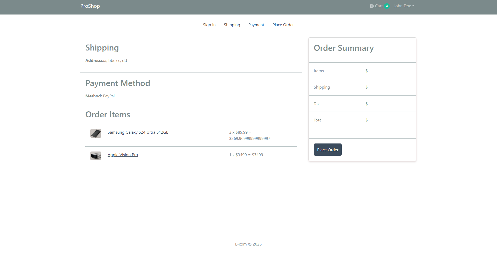
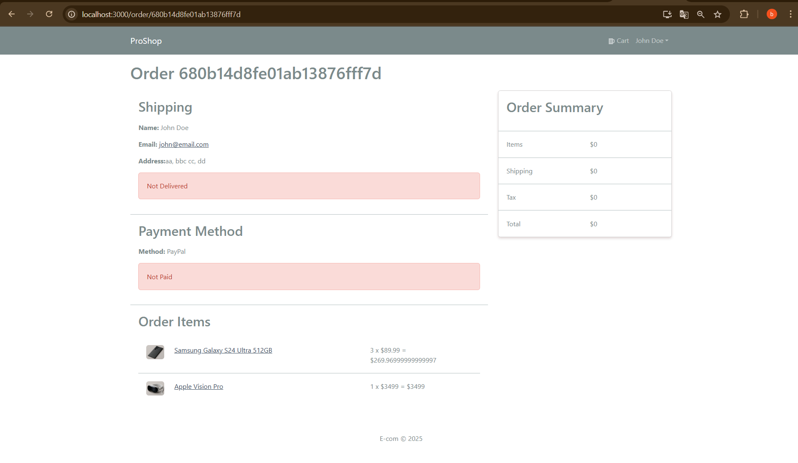

> eCommerce platform built with the MERN stack & Redux.


- [Features](#features)
- [Usage](#usage)
  - [Env Variables](#env-variables)
  - [Install Dependencies (frontend & backend)](#install-dependencies-frontend--backend)
  - [Run](#run)
- [Build & Deploy](#build--deploy)
  - [Seed Database](#seed-database)
- [Outcomes & Screenshots](#outcomes--screenshots)
## Features

- Full featured shopping cart
- Product reviews and ratings
- Top products carousel
- Product pagination
- Product search feature
- User profile with orders
- Admin product management
- Admin user management
- Admin Order details page
- Mark orders as delivered option
- Checkout process (shipping, payment method, etc)
- Database seeder (products & users)

- ## Usage
- Create a MongoDB database and obtain your `MongoDB URI` - [MongoDB Atlas](https://www.mongodb.com/cloud/atlas/register)

  
### Env Variables
Rename the `.env.example` file to `.env` and add the following

```
NODE_ENV = development
PORT = 5000
MONGO_URI = your mongodb uri
JWT_SECRET = 'abc123'
```
Change the JWT_SECRET to what you want.

### Install Dependencies (frontend & backend)

```
npm install
cd frontend
npm install
```

### Run

```

# Run frontend (:3000) & backend (:5000)
npm run dev

# Run backend only
npm run server
```

## Build & Deploy

```
# Create frontend prod build
cd frontend
npm run build
```

### Seed Database

You can use the following commands to seed the database with some sample users and products as well as destroy all data

```
# Import data
npm run data:import

# Destroy data
npm run data:destroy
```

```
Sample User Logins

admin@email.com (Admin)
123456

john@email.com (Customer)
123456

jane@email.com (Customer)
123456
```

---
## Outcomes & Screenshots
This project was developed to simulate a real-world eCommerce flow with both user and admin roles. Key user journeys include user authentication, address collection, order creation, and order tracking—all managed through role-based access control.  

To enhance performance and streamline user experience, token-based authentication with JWT was implemented. User sessions and data flows are efficiently handled using browser-based memory techniques such as cookies and localStorage.

State management across the app is handled with Redux Toolkit to ensure scalable and predictable application behavior.

Below are some screenshots demonstrating the main features:




